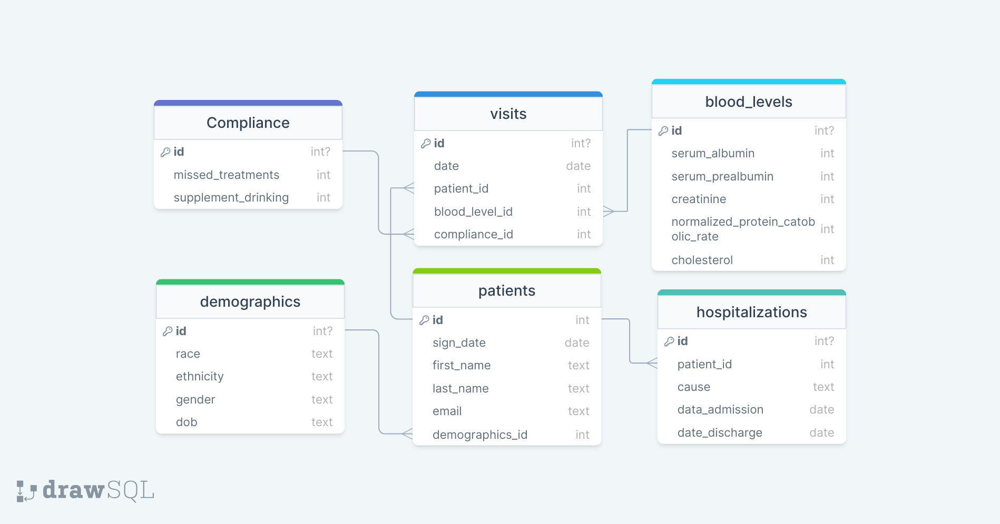

# REDCap to SQLite ETL Tool

## Introduction

This project is a Python-based ETL (Extract, Transform, Load) tool designed to fetch data from a REDCap server and store it in a SQLite database. The ETL process involves the following steps:

1. **Extract**: Data is extracted from the REDCap server using REDCap APIs. Or if the data is already extracted, it is read from the extracted files.
2. **Transform**: The extracted data is then transformed into a format suitable for insertion into a SQLite database and stored as SQL files.
3. **Load**: The transformed data (one SLQ file per patient) is loaded into the SQLite database.

This tool is particularly useful for users needing to transfer large amounts of data from REDCap to SQLite in a reliable and efficient manner.
You can customize the data model and mapping tables to suit your specific requirements. The tool can be easily tested without having access to a REDCap project token by using the provided example data.

## System Setup

### Docker Environment Setup

1. Ensure Docker and Docker-compose are installed on your system. You can verify this by running `docker --version` and `docker-compose --version`  in your terminal.
2. Clone this repository to your local machine.
3. Navigate to the root directory of the cloned repository.
4. Define the Data Model and Mapping to Target Data Model as described in the "Data Model Definition" and "Mapping to Target Data Model" sections below.
5. Create a `config_docker.json` file in the root directory. You can use the `config_docker_example.json` file as a template. Define the parameters as described in the "Config File Setup" section below.
6. Run the docker-compose file by running `docker-compose up`.
7. The ETL process will start automatically, and repeat every 24 hours.

### Python Environment Setup

1. Ensure Python 3.x is installed on your system. You can verify this by running `python --version` in your terminal.
2. Clone this repository to your local machine.
3. Navigate to the root directory of the cloned repository.
4. It is recommended to create a virtual environment to isolate the project dependencies. You can do this by running `python -m venv venv`.
5. Activate the virtual environment by running `source venv/bin/activate` (Linux/Mac) or `venv\Scripts\activate` (Windows).
6. Install the required Python packages by running `pip install -r requirements.txt`.
7. Define the Data Model and Mapping to Target Data Model as described in the "Data Model Definition" and "Mapping to Target Data Model" sections below.
8. Create a `config.json` file in the root directory. You can use the `config_example.json` file as a template. Define the parameters as described in the "Config File Setup" section below.
9. Run the ETL process by running `python workflow.py`.

### Data Model Definition

1. Define your data model in a separate SQL file. This should include the tables and fields that will be present in your SQLite database.
2. Define the path to this file in the `config.json` file under the `db_schema` parameter.

### Mapping to Target Data Model

1. Write a mapping files in your mapping folder (defined in the `config.json` file) to map the extracted data to the target data model. These csv files will help to transform the extracted REDCap data into the format of your SQLite data model.
2. The mapping files should have the following columns:
    - `Table`: The name of the table in the target data model.
    - `Attribute`: The name of the attribute in the target data model.
    - `NotNull`_: NOT NULL if the attribute is required, nothing otherwise.
    - `field_name`: The name of the field in the REDCap data.
For further information, see the [`Mapping.md`](Mapping.md) file and some example mapping files in the `mappingtables` folder of the ClassicDB example.

### Config File Setup

1. Create a `config.json` file in the root directory. This file will store the configuration parameters for the ETL process. You can use the `config_example.json` file as a template.
2. Define the following parameters in the `config.json` file:
    - `repository_root`: The path to the root directory of the cloned repository.
    - `extract_redcap`: True if data should be extracted from REDCap, False otherwise.
    - `redcap_api_address`: The URL of the REDCap API.
    - `redcap_project`: The name of the REDCap project.
    - `redcap_api_token`: The API token for accessing the REDCap project.
    - `extraction_path`: The path where the extracted data should be stored.
    - `data_path`: The path where the data files are stored.
    - `mapping_path`: The path to the mapping tables.
    - `db_creation`: True if the database should be created, False otherwise.
    - `db_wipe`: True if the database should be wiped before loading data, False otherwise.
    - `db_path`: The path where the SQLite database should be stored.
    - `db_schema`: The path to the data model (SQL schema) file.
    - `db_load_data`: True if data should be loaded into the database, False otherwise.

## Example Data

1. The `ClassicDB_example` folder contains [example data](ClassicDB_example/data/ClassicDatabase_DATA.csv), a [data model](ClassicDB_example/sqlite_schema.sql) (see Figure) and their corresponding mapping tables ([One possible mapping of Patient data](ClassicDB_example/mappingtables/1-0-patients.csv)) that can be used to test the ETL process without having access to a REDCap project.
2. The example data is stored in a [CSV file](ClassicDB_example/data/ClassicDatabase_DATA.csv) and can be used to simulate the extraction process.
3. The example data can be used to test the transformation and loading processes as well.



### To run the example data with Docker

1. Copy the 'ClassicDB_Data.csv' file to the Root 'data' folder.
    ```shell
    cp ClassicDB_example/data/ClassicDatabase_DATA.csv data/
    ```
2. Rename the 'config_docker_example.json' file to 'config_docker.json'.
    ```shell
    mv config_docker_example.json config_docker.json
    ```
4. Run the docker-compose file.
    ```shell
    docker-compose up
    ```

### To run the example data with Python

1. Rename the 'config_example.json' file to 'config.json'.
    ```shell
    mv config_example.json config.json
    ```
2. Run the ETL process.
    ```shell
    python workflow.py
    ```
## License

This project is licensed under the MIT License. This means you are free to use, copy, modify, merge, publish, distribute, sublicense, and/or sell copies of the software, under the conditions that you include the following:

1. A copy of the original MIT License in any redistributed copies or substantial portions of the software.
2. A clear acknowledgement of the original source of the software.

For more details, please see the [LICENSE](LICENSE) file in the project root.

## Contributing

Contributions, issues, and feature requests are welcome!

***Enjoy transferring data from REDCap to SQLite efficiently and reliably!***
